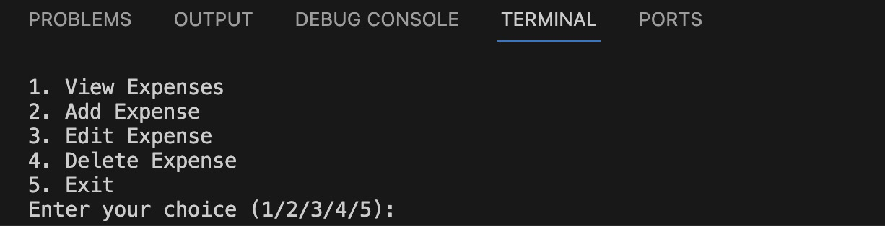

# Simple Expense Tracker

Welcome to the Simple Expense Tracker! This Python script helps you manage your expenses in a straightforward manner. Here's how you can use it:

## Features
1. **View Expenses:** Displays a formatted table of your existing expenses.
2. **Add Expense:** Allows you to input a new expense, including the date, description, and amount.
3. **Edit Expense:** Lets you modify the details of an existing expense, such as the date, description, or amount.
4. **Delete Expense:** Removes a selected expense from your records.
5. **Exit:** Quits the expense tracker.

## Video Tutorial
Watch our video tutorial to get started with the Simple Expense Tracker:

## How to Use
1. Run the script.
2. Choose an option by entering the corresponding number (1, 2, 3, 4, or 5).
3. Follow the prompts to perform the desired action.

## Input Validation
The script includes basic input validation to ensure that required fields are not empty and that amounts are greater than zero. If an error occurs during input, the script will provide an error message.

## License
This Simple Expense Tracker is released under the [MIT License](https://opensource.org/licenses/MIT). Feel free to use, modify, and distribute the script as per the terms of the license.

## Getting Started
1. Clone or download the script to your local machine.
2. Make sure you have Python installed.
3. Run the script in your terminal or command prompt.

Feel free to customize and enhance the script to fit your specific needs. Happy expense tracking!